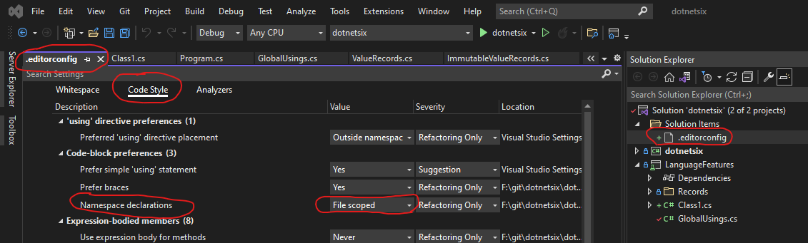

# File scoped namespaces

## Overview

Until recently, when creating a C# class inside a namespace, the code looked something like the below default Main declaration in a .NET console app.

```C#
namespace MyNamespace
{
    class MyClass
    {
        
    }
}
```

In C# 10 this can be simplified:

```C#
// File Scoped Namespace
namespace MyNamespace;

class MyClass
{
}
```

The reduced nesting should make code easier to read and it also saved 2 vertical lines - the curly braces used t define the namespace scope.

<br/>

## Spliting namespace definition across files

As before, you can define the same namespace in multiple files:

`MyClass.cs`

```C#
// File Scoped Namespace
namespace MyNamespace;

class MyClass
{
}
```

`MyOtherClass.cs`

```C#
// File Scoped Namespace
namespace MyNamespace;

class MyOtherClass
{
}
```

<br/>

## Nesting namespaces or multiple namespaces in the same file

File scoped namespaces **are not compatible with nested namespaces**. Also, **only one file scoped namespace is legal per file**.

 The below examples are not allowed:

```C#
// File Scoped Namespace
namespace MyProject;

class Demo
{
}

namespace AnotherNamespace; // not allowed

namespace NestedNamespace // not allowed
{
    class Foobar() {}
}

```

In the rare cases where you need to define multiple or nested namespaces in the same file, you need to revert to the old syntax.

```C#
namespace MyNamespace
{
    namespace MyNesteNamespace
    {

    }
}

namespace MyOtherNamespace
{
    namespace MyNesteNamespace
    {

    }
}

```

<br/>

## Visual Studio support

Although supported, Visual Studio (not even VS 2022) does not use file scoped namespaces by default when adding a new class to your solution.

To enable file scoped namespaces as the default option, you need to add an `.editorconfig` file with the proper flag.

The `.editorconfig` file can be scoped to the entire solution or to a single project. Below is an example showing how to enable solution wide usage in Visual Studio 2022.



The `.editorconfig` file should be versioned so that all project contributors use the same standard. You can see an example in the [current repository](https://github.com/buggy-line/dotnetsix/blob/main/.editorconfig#L127).
