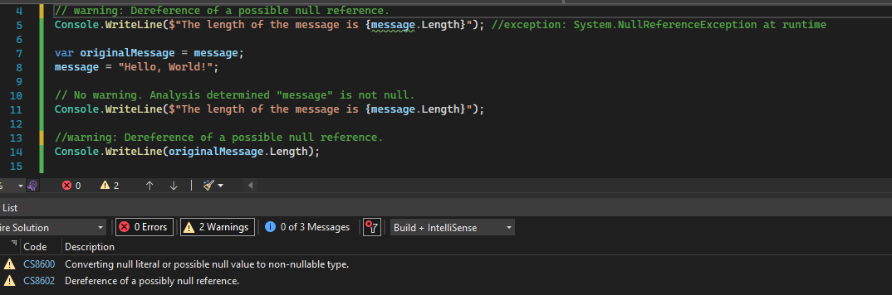

# Nullable reference types

Although introduced with C# 8, nullable reference types were not enabled by default. This changes with .NET 6 - null state analysis and variable annotations are enabled by default for new projects. For old projects they are still disabled.

To set nullable references as the default for existing projects, add the `<nullable>Enable</nullable>` flag to the project settings.

# Null state analysis
When enabled, the compiler tracks the null state of each reference. Warnings are emitted when trying do dereference(i.e. `.` dot operator) a potentially null variable.

The compiler determines that a variable is not-null in two ways:

1. The variable has been assigned to a value that is known to be not null.
2. The variable has been checked against null and hasn't been modified since that check.

```C#
//warning: Converting null literal or possible null value to non-nullable type.
string message = null;

// warning: Dereference of a possible null reference.
Console.WriteLine($"The length of the message is {message.Length}"); //exception: System.NullReferenceException at runtime

var originalMessage = message;
message = "Hello, World!";

// No warning. Analysis determined "message" is not null.
Console.WriteLine($"The length of the message is {message.Length}");

//warning: Dereference of a possible null reference.
Console.WriteLine(originalMessage.Length);

```

Interestingly, the compiler does not output the last warning for `originalMessage.Length` on my machine, using Visual Studio 2022 Community Edition v17.0.6.
This is contrary to [expected behavior in the official docs](https://docs.microsoft.com/en-us/dotnet/csharp/nullable-references).



# Attributes on API signatures

Compare the below two code fragments 

> Compiler warning + runtime exception
```C#
string message = null;
if (string.IsNullOrWhiteSpace(message))
{
    Console.WriteLine($"The length of the message is {message.Length}");  //warning: Dereference of a possible null reference.
}
```

> No compiler warning.
```C#
    string message = null;
    if (!string.IsNullOrWhiteSpace(message))
    {
        Console.WriteLine($"The length of the message is {message.Length}");  //no warning.
    }
```

The compiler is now able to provide semantic feedback as long as the API developers make use of relevant attributes. In this case the compiler infers that when `string.IsNullOrWhitespace(message)` return `false` it is safe to dereference the variable thanks to the [`NotNullWhen`](https://docs.microsoft.com/en-us/dotnet/api/system.diagnostics.codeanalysis.notnullwhenattribute?view=net-6.0) attribute.

> `IsNullOrWhitespace` method declation
```C#
public static bool IsNullOrWhiteSpace([NotNullWhen(false)] string? value)
```

See the list of attributes for null-state static analysis in the [official docs](https://docs.microsoft.com/en-us/dotnet/csharp/language-reference/attributes/nullable-analysis).

# Pitfalls

## Generics
Nullable reference types combined with generics do not offer the same compile time safety that are present with nullable value types.

Consider a generic type Wrapper with a `notnull` type constraint.

```C#
public class Wrapper<T> where T: notnull
{
    public Wrapper(T value)
    {
        Value = value;
    }

    public T Value { get; set; }
}

```

Assigning a possible null value to the .Value only generates a compile time warning:

```C#
var referenceWrapper = new Wrapper<string>("foobar");
string? nullString = null;
referenceWrapper.Value = nullString;  //warning: possible null reference assignment
```

The warning can be easily silence using the [null forgiving operator](https://docs.microsoft.com/en-us/dotnet/csharp/language-reference/operators/null-forgiving) `!`

```C#
var referenceWrapper = new Wrapper<string>("foobar");
string? nullString = null;
referenceWrapper.Value = nullString!;  //no warning
referenceWrapper.Value = null!;  //no warning
```

The same code using a value type wrapper will generate a compile time error. The null forgiving operator cannot be used to circumvent the error. 

```C#
var valueWrapper = new Wrapper<int>(101);
int? nullInt = null;
valueWrapper.Value = nullInt;  //error: cannot convert int? to int
valueWrapper.Value = nullInt!;  //error: cannot convert int? to int
```

The same behavior can be observed with the generic collection types.

```C#
var x = new List<string>();
x.Add(null!);   //no warning
x.Add(null);   //warning

var y = new List<int>();
y.Add(null);    //error
y.Add(null!);    //error
```